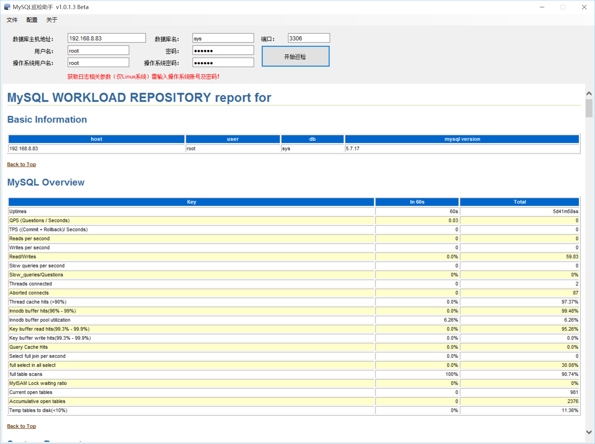

# MySQL巡检助手（MySQL Watcher）
* Author:Jack R. Ge

* Email:jack_r_ge@126.com

## 运行环境
* Windows 7/10

## 安装
下载“QL_Helper_v1.0.1.3.zip”后解压，运行解压后的“MySQL巡检助手v1.0.1.3.msi”安装包，按提示完成。

## 运行界面
* 双击桌面上的程序图标运行程序。

* 输入服务器连接信息，点击开始巡检，稍等片刻即可生成报告。

* 点击“配置”菜单中的“自定义参数配置”，可以修改生成报告的项目。

